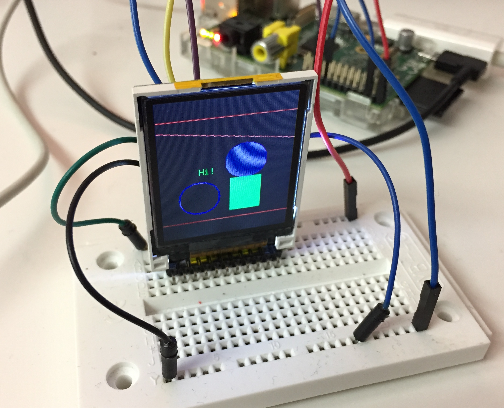

# st7735-rs

This is a library for displays using the ST7735 driver. Documentation is available [here](https://docs.rs/st7735).



Currently, there is support for using hardware SPI as well as software SPI to
communicate to the display. Note that using hardware SPI is much faster and
recommended to be used if supported by the connecting device.

The driver also provides a simple graphics library which currently supports drawing the
following shapes:
* Rectangles (filled and border only)
* Circles (filled and border only)
* Lines (horizontal, vertical, and diagonal)
* Text (characters)

## Usage

To use the crate please add the following to your `Cargo.toml`:

```
[dependencies]
st7735 = "0.1.0"
```

Please refer to `/examples` for more examples.

```rust
extern crate st7735;
use st7735::color::{Color, DefaultColor};
use st7735::fonts::font57::Font57;
use st7735::Orientation;
use st7735::ST7734;
use linux_embedded_hal::spidev::{SpidevOptions, SpidevTransfer, SPI_MODE_0};
use linux_embedded_hal::Spidev;
use linux_embedded_hal::Delay;
use linux_embedded_hal::Pin;

let mut spi = Spidev::open("/dev/spidev0.0").expect("error initializing SPI");
let options = SpidevOptions::new()
    .bits_per_word(8)
    .max_speed_hz(20_000)
    .mode(SPI_MODE_0)
    .build();
spi.configure(&options).expect("error configuring SPI");

let mut display = ST7734::new_with_spi(spi, Pin::new(25), Delay);display.clear_screen();
display.set_orientation(&Orientation::Portrait);
let color_red = Color::from_default(DefaultColor::Red);
display.draw_horizontal_line(0, 128, 20, &color_red);
display.draw_horizontal_line(0, 128, 140, &color_red);
display.draw_rect(30, 30, 60, 70, &Color::from_default(DefaultColor::Blue));
```

### Connecting the Display

I tested this create using a Raspberry Pi model A and a SainSmart 1.8" TFT LCD Display with the following wiring for SPI:

| Raspberry Pi      | Display |
| ----------------- | ------- |
| GND (Pin 6)       | CS      |
| GPIO 25 (Pin 22)  | RS/DC   |
| GPIO 10 (Pin 19)  | SDA     |
| GPIO 11 (Pin 23)  | SCL     |
| GND (Pin 6)       | GND     |
| 5V  (Pin 2)       | VCC     |

When using the software SPI with other pins or even in the hardware SPI case it might be necessary to explicitly
give permission to access GPIOs on the Raspberry Pi:

```
echo "25" > /sys/class/gpio/export
sudo sh -c 'echo out > /sys/class/gpio/gpio25/direction'
```

### Building

To build this crate on the target platform (for example a Raspberry Pi) you can simply run `cargo build` if `cargo` is installed.

To build this crate on a platform used for development that is not the target platform (for example macOS), I recommend
using [crosstool-ng](https://github.com/crosstool-ng/crosstool-ng) which will install the necessary toolchains. To build
the crate for a Raspberry Pi model A run:

```
cargo build --target=arm-unknown-linux-gnueabi
```

For more details about installing required tools and setting up everything to build this crate, I wrote a more elaborate blog post about setting up
[Rust for embedded system programming on macOS](https://scholtzan.net/blog/embedded-system-programming-with-rust-on-macos/).

## Roadmap

- [ ] Support more shapes
- [ ] Support rendering text instead of just one character
- [ ] Support more fonts
- [ ] Add support for reading SD card
- [ ] Draw bitmaps

## Resources

This crate is based on the series [_Add a TFT Display to the Raspberry Pi_](http://w8bh.net/pi/TFT1.pdf) by Bruce E. Hall and the [Adafruit-ST7735-Library
](https://github.com/adafruit/Adafruit-ST7735-Library).

## Contributing

Contributions are always welcome! Feel free to fork the repository and create pull-requests.

## License

MIT
